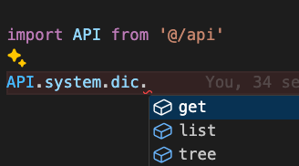

## SCUI · Vite 版本说明

本仓库基于
👉 [https://gitee.com/lolicode/scui](https://gitee.com/lolicode/scui)

在**保留原有功能与目录结构的前提下**，完成了以下改造：

---

## 一、基础说明

* 项目已由 **Vue CLI** 脚手架迁移至 **Vite**
* 包管理工具由 **npm** 改为 **pnpm**
* 请务必使用 **pnpm 安装依赖**

```bash
pnpm install
pnpm dev
```

---

## 二、状态管理：Vuex → Pinia

项目中已 **完全移除 Vuex**，统一使用 **Pinia**。

### 1️⃣ 原 Vuex 写法（before）

```js
this.$store.state.xxx
```

---

### 2️⃣ Pinia 写法（after）

#### ✅ setup 语法（推荐）

```js
import { useGlobalStore } from '@/store'

const store = useGlobalStore()
store.xxx
```

---

#### ⚠️ Options API（不推荐，但可用）

```js
import { useGlobalStore } from '@/store'

export default {
  computed: {
    globalStore() {
      return useGlobalStore()
    }
  },
  methods: {
    test() {
      this.globalStore.xxx
    }
  }
}
```

> ⚠️ **强烈建议使用 setup 语法**
> Options API 仅为兼容旧代码，不再推荐新增使用

---

## 三、代码规范：新增 ESLint 格式化

项目已新增 **ESLint 配置**，用于：

* 统一代码风格
* 格式化代码
* 将部分「原本只是 error 的语法」升级为 **warning** (本人强烈建议还是改为 error, 但是本部分不会影响项目运行)

> 当前 ESLint 规则偏严格，
> 可根据团队或个人需要自行调整 `eslint.config.js`

---

## 四、样式相关注意事项（SCSS）

### ❌ 不再使用 `@import`

```scss
@import './style.scss'; // 已弃用
```

### ✅ 使用 `@use`

```scss
@use './style.scss';
```

> `@import` 已被 Sass 官方弃用，未来版本将直接移除

---


## 五、模块与文件导入规范（非常重要）

### 1️⃣ 关于 `require / require.context`

#### ❌ 禁止使用全局 `require / require.context`

例如 **旧写法（不推荐）**：

```js
/**
 * @description 自动 import 所有 api 模块
 */
const files = require.context('./model', false, /\.js$/)
const modules = {}
files.keys().forEach((key) => {
  modules[key.replace(/(\.\/|\.js)/g, '')] = files(key).default
})
export default modules
```

❌ 问题：

* 无类型提示
* IDE 无法跳转
* 难以维护
* **依赖 webpack 特性，Vite 不支持**

---

### 2️⃣ 推荐的模块导入方式（显式 ESM）

```js
import auth from './model/auth'
import common from './model/common'
import demo from './model/demo'
import system from './model/system'

export default {
  auth,
  common,
  demo,
  system,
}
```

✅ 优点：

* IDE 代码提示完整
* 支持类型检查
* 易于维护
* 完全符合 **Vite / ESM 标准**



> 📌 **唯一例外**：路由中按需加载 `.vue` 文件

---

> [!IMPORTANT]
> `Vue` 文件导入差异

### 3️⃣ 关于 `.vue` 文件的导入差异（Webpack vs Vite）

#### ❌ Webpack 时代的写法（已不推荐）

在 **webpack（Vue CLI）** 中，下面的写法是成立的：

```js
import A from './a'
```

Webpack 会自动解析为：

```
./a/index.vue
```

这是 **webpack 的非标准解析能力**。

---

#### ✅ Vite / ESM 的正确写法

Vite 基于 **标准 ESM 模块规范**，不会做隐式推断，
因此必须 **显式指定 `.vue` 后缀**：

```js
import A from './a/index.vue'
// 或
import A from './a.vue'
```

❗ 否则将直接报错，无法解析模块。

---

### 4️⃣ 推荐规范（强烈建议）

* ❌ 不依赖 webpack 的隐式解析规则
* ❌ 不省略 `.vue` 后缀
* ✅ 所有 Vue 文件 **显式写明路径与后缀**
* ✅ 按 ESM 标准组织模块

这不仅是为了兼容 Vite，也是为了：

* 提升代码可读性
* 降低迁移成本
* 减少「环境相关问题」

---

## 说明补充

本项目已完全脱离 webpack 体系，
所有模块解析行为均遵循 **标准 ESM 规范**。

---
## 六、关于部分历史代码的说明

项目中存在一些 **原本语法并不规范的代码**，
当前只是通过 ESLint 配置「不再报错」，例如：

```js
let del
try {
  del = await config.delMy(this.filterName)
}
catch (error) {
  return false
}
if (!del) {
  return false
}
this.myFilter.splice(index, 1)
this.$message.success('删除常用成功')
```

⚠️ **不建议继续这样写**
这类写法存在可读性和维护性问题，仅作为历史兼容保留。

---

## 七、最终建议（强烈）

> ⚠️ **本项目仅用于临时应急 / 参考**

### 强烈建议：

* ❌ 不要继续写 **纯 JS**
* ✅ 使用 **TypeScript**
* ❌ 不要再新增 **Options API**
* ✅ 使用 **setup / Composition API**

这是当前 Vue 生态下：

* 可维护性最好
* IDE 支持最完整
* 与 Vite / Pinia / ESLint 最契合的方式


